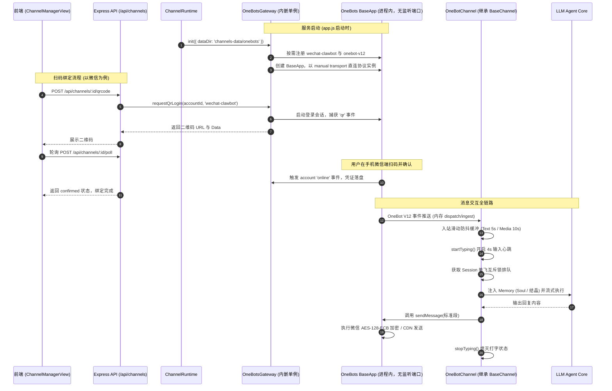

# OneBots 库级内嵌驱动集成开发指南 (方案 B)

> **版本**：v1.0.0  
> **编制日期**：2026-09-07  
> **适用范围**：MioChat Channel 渠道子系统（`channels/`）底层协议驱动重构  
> **运行环境**：Node.js >= 24.0.0 (单进程模型)

---

## 1. 架构总览与分层设计

为了贯彻 **“零外部中间件，git clone 下来 pnpm dev 单进程直接运行”** 的开发体验，我们将 OneBots 作为库级模块直接引入主应用中，由 `ChannelRuntime` 纳管其生命周期。



---

## 2. 核心模块规划与职责边界

在未来的代码实施阶段，渠道层将新增并重构以下关键模块：

```
channels/
├── common/
│   ├── BaseChannel.js         # 现有的统一 Agent 抽象基类 (保持 100% 稳定，防抖/单飞锁/确认/记忆)
│   ├── ConfirmationManager.js # 高危工具调用挂起与确认
│   └── SlashHandler.js        # /help, /new, /yolo, /btw 斜杠指令
├── onebots/                   # [新增] OneBots 驱动层集成目录
│   ├── OneBotsGateway.js      # 进程内 OneBots 单例管理器 (生命周期、账号挂载、扫码事件捕获)
│   ├── OneBotChannel.js       # 继承 BaseChannel 的通用 OneBot 渠道适配器
│   └── config.js              # OneBots 运行时配置常量与端口策略
├── ChannelRuntime.js          # [重构] 渠道运行时生命周期管控 (纳管 OneBotsGateway 与各渠道实例)
├── ChannelStore.js            # 渠道配置存储 (SQLite / JSON)
└── wechat/                    # 现有的自研 iLink 实现 (保留作为参考及平滑过渡备选)
```

### 2.1 OneBotsGateway (内嵌网关单例)
- **定位**：Node.js 内部唯一的 OneBots 运行时代理，负责与 OneBots 的 `BaseApp` 打交道。
- **职责**：
  1. **进程内传输**：不启动 OneBots HTTP/WS 监听；V12 事件通过 `dispatch -> ingest`、动作通过 `protocol.apply()` 在内存中直接传递；
  2. **适配器按需加载**：第一阶段动态导入并注册 `@onebots/adapter-wechat-clawbot`；飞书与 Telegram 在第三阶段再增加依赖和凭据表单；
  3. **协议提供**：注册 `@onebots/protocol-onebot-v12` 协议转换器；
  4. **扫码事件汇聚中心**：
     - 维护一个内存 Map：`qrSessions: Map<accountId, { qrCodeUrl, qrcode, status, timer }>`；
     - 监听各账号的 `qr` 事件，暂存二维码数据；
     - 监听账号 `online` 与 `credential_stale` 事件，驱动管理面板轮询状态。

### 2.2 OneBotChannel (通用业务渠道)
- **定位**：继承自 `BaseChannel`，作为连接 OneBots 协议层与 MioChat Agent 业务层的标准桥梁。
- **职责**：
  1. **底层通信**：使用官方客户端 `@imhelper/onebot-v12` 的 `manual` 接收模式，无 socket 和端口占用；
  2. **消息入站**：接收 `message.private` 和 `message.group`，解构文本与媒体段，推入 `this.enqueueInboundDebounce()`；
  3. **下行发送**：
     - 实现 `doSendMessage`：调用 `client.sendMessage(...)` 发送文本；
     - 实现 `doSendImage`：构造 OneBot V12 Image Segment 发送（支持 Local Path / URL / Base64）；
     - 实现 `doSendTyping`：调用 OneBots 平台的 `send_typing` 动作（维持输入心跳）。

---

## 3. 详细接口设计与生命周期约定

### 3.0 渐进式启用

为了不在升级后立即切换已有微信账号，旧 `type: wechat` 记录默认仍使用自研 iLink 驱动。可通过以下任一方式显式启用 OneBots：

- 新建 `type: onebots` 的渠道（当前默认映射到 `wechat-clawbot`）；
- 部署时设置 `MIO_WECHAT_DRIVER=onebots`，让现有管理面的 `wechat` 流程无需前端修改即切换到 OneBots。

### 3.1 OneBotsGateway 规范签名
```ts
export class OneBotsGateway {
  /** 初始化并启动内部 OneBots 实例 */
  async init(options?: { port?: number, logLevel?: string }): Promise<void>;

  /** 动态注册并启动一个账号 */
  async startAccount(channelConfig: {
    id: string;
    platform: string; // 'wechat-clawbot' | 'feishu' | 'telegram' 等
    credentials?: Record<string, any>;
  }): Promise<void>;

  /** 停止并注销一个账号 */
  async stopAccount(channelId: string): Promise<void>;

  /** 获取正在等待扫码的二维码凭证 */
  getQrCode(channelId: string): { qrCodeUrl: string; qrcode: string; status: string } | null;

  /** 销毁内部服务（在应用退出时调用） */
  async dispose(): Promise<void>;
}
```

### 3.2 ChannelRuntime 联动改造
在 `ChannelRuntime.js` 中：
```js
export class ChannelRuntime {
  constructor(opts) {
    this.channelStore = opts.channelStore;
    this.onebotsGateway = new OneBotsGateway();
    // ...
  }

  async init() {
    // 1. 初始化并启动内嵌 OneBots 网关
    await this.onebotsGateway.init();
    // 2. 恢复需要开机自启的运行中渠道
    await this.restoreRunningChannels();
  }

  async start(channelId) {
    const channel = await this.channelStore.get(channelId);
    // 判断若为 OneBots 纳管平台：
    await this.onebotsGateway.startAccount(channel);
    const chn = new OneBotChannel({
      channelId,
      gateway: this.onebotsGateway,
      memory: await this.createMemory(channel.agentId),
      // 注入 Agent 基础配置
    });
    await chn.start();
    this.running.set(channelId, { chn, channel });
    return chn;
  }
}
```

---

## 4. 依赖项与 Node 24 适配指南

### 4.1 package.json 依赖清单
在进入代码落地时，需在 `package.json` 中配置：

```json
{
  "engines": {
    "node": ">=24.0.0"
  },
  "dependencies": {
    "onebots": "1.2.12",
    "@onebots/protocol-onebot-v12": "3.0.12",
    "@onebots/adapter-wechat-clawbot": "3.0.12",
    "@imhelper/onebot-v12": "1.0.9",
    "imhelper": "1.0.9"
  }
}
```

### 4.2 环境与构建考量
- **Node.js 24 兼容性**：OxLint、Prettier 以及现存测试套件（`node:test`）在 Node 24 下表现优异；
- **原生模块**：`better-sqlite3`（v12.9.0）在 Node 24 环境下已有完备的预编译二进制或 node-gyp 支持，无需额外 C++ 补丁；
- **配置持久化**：嵌入式网关配置与 SQLite 数据存放在 `channels-data/onebots/`；当前上游 `wechat-clawbot` 会话凭证仍按其约定存放在 `data/wechat-clawbot/<account_id>.json`，两个目录均已被 Git 忽略。

---

## 5. 多平台横向扩展规范 (飞书 / Telegram / 钉钉)

得益于 OneBots 对 26 个平台的统一抽象，当后续需要新增渠道时，开发者仅需：

1. **前端 `ChannelManagerView.vue`**：
   在新建渠道弹窗中新增类型下拉选项（如 `feishu`、`telegram`），当选中非扫码平台时，展示对应的凭据表单：
   - 飞书：`app_id`、`app_secret`、`verification_token`
   - Telegram：`bot_token`
   - 钉钉：`client_id`、`client_secret`
2. **后端 `ChannelStore`**：
   直接将凭据字典存储至 `channel.credentials` 字段中；
3. **驱动挂载**：
   `OneBotsGateway` 动态注册对应的 `adapter-feishu` 并传入配置，无需为各平台单独写业务消息处理器，**全部直接复用 `OneBotChannel`**！

---

## 6. 后续分步实施演进路线

为确保系统稳定性，建议在后续进入代码开发时采用三阶段推进：

- **阶段一（环境准备与网关打样）**：
  - 更新 Node.js 引擎声明至 `>=24.0.0`，安装 `onebots` 相关依赖；
  - 编写 `OneBotsGateway.js` 并在单元测试中验证内部实例启停与回环通信。
- **阶段二（微信 ClawBot 迁移验证）**：
  - 编写 `OneBotChannel.js` 并对接微信扫码事件流；
  - 跑通真实微信收发 -> 防抖 -> 正在输入打字心跳 -> LLM 回复全链路；
  - 与现存的自研 `IlinkClient.js` 进行 A/B 对比。
- **阶段三（第二渠道开箱——飞书/Telegram）**：
  - 在前端管理面板暴露飞书 / Telegram 配置项；
  - 验证使用同一个 `OneBotChannel` 无缝驱动飞书和 Telegram，彻底宣告通用多渠道体系落成。
